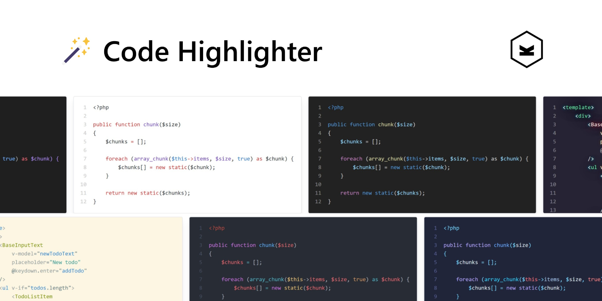

> [!NOTE]
> A server-side syntax highlighter plugin for Kirby CMS, powered by [Phiki](https://github.com/phikiphp/phiki), that uses TextMate grammars and VS Code themes to generate syntax-highlighted code within code blocks and KirbyText.

## ✨ Key Features
- ⚡ **Performance:** Fast and powerful syntax highlighting.
- 🚀 **Integration:** Works with Kirby code blocks and KirbyText.
- 🌍 **Languages:** Over 200+ programming languages.
- 🎨 **Themes:** Choose from 50+ stunning themes.
- 🔐 **Base64 Support:** Handles base64-encoded content.

## 📦 Installation

### Composer

```bash
composer require bogdancondorachi/kirby-code-highlighter
```

### Git Submodule
```bash
git submodule add https://github.com/bogdancondorachi/kirby-code-highlighter.git site/plugins/code-highlighter
```

### Manual

[Download](https://api.github.com/repos/bogdancondorachi/kirby-code-highlighter/zipball) and extract to: `/site/plugins/code-highlighter`

## ⚙️ Usage

### Kirby Blocks Field

This plugin seamlessly integrates with Kirby's native [`code` block](https://getkirby.com/docs/reference/panel/blocks/code) replacing its default behavior:

```yaml
blocks:
  type: blocks
  fieldsets:
    - code
```
*By default, the code block uses the default theme, but a theme selector is available if you wish to apply different themes to individual blocks. You can also customize the available language and theme options through the configuration settings.*

### KirbyText
Embed syntax-highlighted code directly in KirbyText fields:

<pre lang="no-highlight"><code>```php
echo "Hello, world!";
```
</code></pre>

Or use the plugin's custom KirbyTag with support for base64-encoded content:

```
(code: ZWNobyAiSGVsbG8sIHdvcmxkISI7 lang: php theme: github-light)
```
*By default, the code tag applies the default theme. However, you can use the theme attribute to specify a different `theme` for individual code blocks.*

## 🔧 Configuration
These options allow you to customize themes, language support, line numbering, and block behavior. All options are defined in your `config.php` file.

### Default Theme
Set the default theme:

```php
'bogdancondorachi.code-highlighter' => [
  'theme' => 'github-dark-dimmed',
],
```

### Light/Dark Dual Themes
Set dual themes for light/dark mode:

```php
'bogdancondorachi.code-highlighter' => [
  'themes' => [
    'light' => 'github-light',
    'dark' => 'github-dark'
  ]
],
```

Add one of the CSS snippet's to make it reactive to your site's theme:

#### Query-based Dark Mode
```css
@media (prefers-color-scheme: light) {
  .phiki,
  .phiki span {
    color: var(--phiki-light);
    background-color: var(--phiki-light-bg);
  }
}

@media (prefers-color-scheme: dark) {
  .phiki,
  .phiki span {
    color: var(--phiki-dark);
    background-color: var(--phiki-dark-bg);
  }
}
```

#### Class-based Dark Mode
```css
html.light .phiki,
html.light .phiki span {
  color: var(--phiki-light);
  background-color: var(--phiki-light-bg);
}

html.dark .phiki,
html.dark .phiki span {
  color: var(--phiki-dark);
  background-color: var(--phiki-dark-bg);
}
```

### Line Numbering
Enable line numbers in your highlighted code blocks:

```php
'bogdancondorachi.code-highlighter' => [
  'gutter' => true,
],
```

### Custom Languages and Themes for Code Blocks
Customize the languages and themes available in Kirby’s code block:

```php
'bogdancondorachi.code-highlighter' => [
  'block.languages' => [
    'css' => 'CSS',
    'php' => 'PHP',
    'js' => 'JavaScript',
  ],
  'block.themes' => [
    'github-dark' => 'GitHub Dark',
    'github-light' => 'GitHub Light',
    'plastic' => 'Plastic',
  ],
],
```

#### Explore Supported Options
- [Supported Languages](https://shiki.matsu.io/languages)
- [Supported Themes](https://shiki.matsu.io/themes)

### Front-end Block Styling
Customize the block style to match your design. Here's an example:

```css
.phiki {
  margin: 2rem 0;
  padding: 1rem;
  font-size: .875rem;
  line-height: 1.5rem;
  overflow: auto;
  border-radius: .25rem;
  box-shadow: 0 1px 3px 0 rgba(0, 0, 0, 0.1), 0 1px 2px 0 rgba(0, 0, 0, 0.06);
}

.phiki .line-number {
  margin-right: 1rem;
  text-align: right;
}
```

## 🙏 Credits
- [Ryan Chandler](https://github.com/ryangjchandler) for his excellent work on porting Shiki to PHP via [Phiki](https://github.com/phikiphp/phiki).
- [Johann Schopplich](https://github.com/johannschopplich) for his [Kirby Highlighter](https://github.com/johannschopplich/kirby-highlighter), which served as base for this project.

## 📜 License
[MIT License](./LICENSE) Copyright © 2024 [Bogdan Condorachi](https://github.com/bogdancondorachi)
